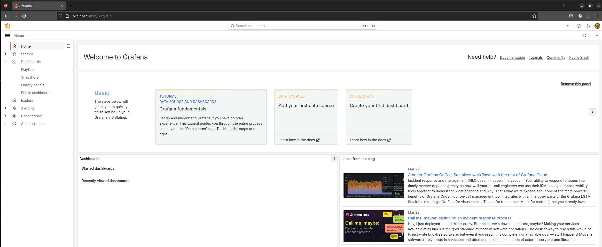

# DashboardsVizHub

## Check Docker Version

```bash
$ docker --version
Docker version 25.0.3, build 4debf41

$ docker-compose --version
docker-compose version 1.29.2, build unknown
```

## Grafana BI

```bash
# Set Project 
$ export PROJECT_ROOT=/mnt/Local_Host/Git_Repo/DashboardsVizHub/GrafanaBI

# Set Alias
$ alias dc="export COMPOSE_PROJECT_NAME='GrafanaBI' && docker-compose"

# Go to Path
$ cd "$PROJECT_ROOT"/setup

# Build & Start Grafana Image
$ dc up -d --build grafana

# Inspect Containers
$ dc ps
       Name           Command           State                            Ports                  
------------------------------------------------------------------------------------------------
grafanabi_grafana_1   /run.sh   Up (health: starting)   0.0.0.0:3033->3000/tcp,:::3033->3000/tcp

# Inspect Logs
$ dc logs -f grafana 

# Inspect Docker Images
$ docker images
REPOSITORY          TAG       IMAGE ID       CREATED         SIZE
grafanabi_grafana   latest    bd0c3812a841   8 days ago      494MB

# Shut down containers
$ dc down
```
