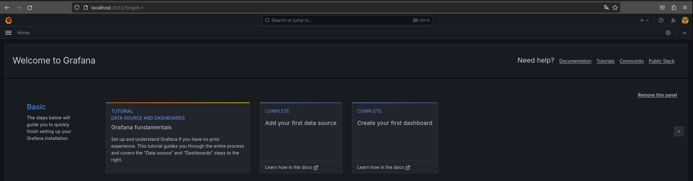

# DashboardsVizHub

## Check Docker Version

```bash
$ docker --version
Docker version 25.0.3, build 4debf41

$ docker-compose --version
docker-compose version 1.29.2, build unknown
```

## Grafana BI

### Setup

```bash
# Set Project 
$ export PROJECT_ROOT=/mnt/Local/Git_Repo/DashboardsVizHub/GrafanaBI

# Set Alias
$ alias dc="export COMPOSE_PROJECT_NAME='GrafanaBI' && docker-compose"

# Go to Path
$ cd "$PROJECT_ROOT"/setup

# Build & Start Database Service
$ dc up -d --build mssqlserver

# Build & Start Grafana Service
$ dc up -d --build grafana

# Inspect Containers
$ dc ps
         Name                        Command                       State                             Ports                   
-----------------------------------------------------------------------------------------------------------------------------
grafanabi_grafana_1       /run.sh                          Up (health: starting)   0.0.0.0:3033->3000/tcp,:::3033->3000/tcp  
grafanabi_mssqlserver_1   /opt/mssql/bin/permissions ...   Up                      0.0.0.0:14334->1433/tcp,:::14334->1433/tcp


# Inspect Logs
$ dc logs -f grafana 

# Inspect Docker Images
$ docker images
REPOSITORY              TAG       IMAGE ID       CREATED         SIZE
grafanabi_mssqlserver   latest    8b7dceebb78a   3 weeks ago     1.48GB
grafanabi_grafana       latest    7da9f83839e0   5 weeks ago     494MB

# Shut down containers
$ dc down
```

### Dashboards

<!-- -->
<!--  -->


